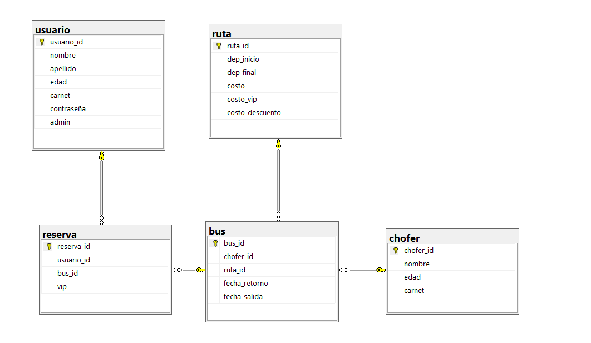

<!-- Markdown -->
<div style="display: flex; justify-content: ">
  <h1 style="margin: 0;" >  PASA "Viajar nunca fue más simple" </h1>
</div>
## Descripción

La aplicación de reservas de buses es una solución diseñada para administrar las operaciones de una flota de buses mediante una interfaz de cliente y administrador. Este proyecto tiene como objetivo aplicar buenas prácticas en bases de datos y programación, así como aplicar los conocimientos adquiridos en la clase de Bases de Datos 2. Los usuarios pueden realizar reservas de buses, consultar información relacionada y administrar el sistema de transporte.


## Video

[](https://drive.google.com/file/d/1NAG6RkiZN7XI502VA-ma2FuVwAHScZMw/view)

## Funcionalidades

### Interfaz de Administrador

El administrador tiene acceso completo a las siguientes funcionalidades:

- **Gestión de usuarios**:
  - Ver usuarios existentes
  - Eliminar usuarios
  - Modificar usuarios
  - Crear cuentas de usuario

- **Gestión de buses**:
  - Ver buses existentes
  - Agregar buses
  - Eliminar buses
  - Modificar buses

- **Gestión de choferes**:
  - Ver choferes existentes
  - Agregar choferes
  - Eliminar choferes
  - Modificar choferes

- **Gestión de rutas**:
  - Ver rutas existentes
  - Agregar rutas
  - Eliminar rutas
  - Modificar rutas

- **Reservas**:
  - Ver reservas existentes

- **Reportes**:
  - Generar reportes de las operaciones del negocio

### Interfaz de Cliente

El cliente tiene acceso a las siguientes funcionalidades:

- **Reserva de Buses**:
  - Seleccionar punto de partida y destino
  - Elegir fecha de partida y fecha de regreso
  - Definir número de pasajeros
  - Seleccionar clase de asiento (económico o VIP)

- **Pago**:
  - Pagar el costo total de la reserva
  - Aplicación de descuento del 50% si se paga con el método Yolo (Banco Ganadero)

- **Facturación**:
  - Generar factura de la reserva

- **Historial de Compras**:
  - Ver el historial de reservas anteriores

### Procedimientos Almacenados (Stored Procedures)

La base de datos incluye 22 procedimientos almacenados (stored procedures) que permiten controlar la concurrencia y gestionar las transacciones de manera eficiente.

### Vistas

Se implementan vistas para generar reportes de gestión, los cuales pueden ser utilizados por los gerentes para evaluar el desempeño del negocio.

### Triggers

Se han implementado triggers para asegurar que la eliminación de registros se realice de manera segura. Estos triggers también gestionan las relaciones de claves foráneas, estableciendo valores nulos para evitar errores al eliminar registros.

## Seguridad y Roles

La base de datos implementa diferentes roles con permisos específicos:

- **Gerente**: Acceso total a todas las funciones de administración.
- **Vendedor**: Acceso restringido a funciones de reservas y pagos.
- **DBA (Administrador de Base de Datos)**: Acceso completo a la base de datos para administración y mantenimiento.

## Descuento Yolo

Se ha implementado un sistema de descuento del 50% sobre el precio VIP de la ruta seleccionada, que se aplica al realizar el pago utilizando el método de pago Yolo (Banco Ganadero).

## 📊 Estructura de Base de Datos

### Diagramas de relación entidad



###  Diagramas de clases


## 👥 Equipo y Contribuciones

### Equipo Principal
```
Alejandro Ramirez
Josue Balbontin
Fernando Terrazas
```

## 📄 Licencia

MIT License 

Application: Pasa v2.1

Copyright (c) 2024 Alejandro Ramírez, Josue Balbontin and Fernando Terrazas
